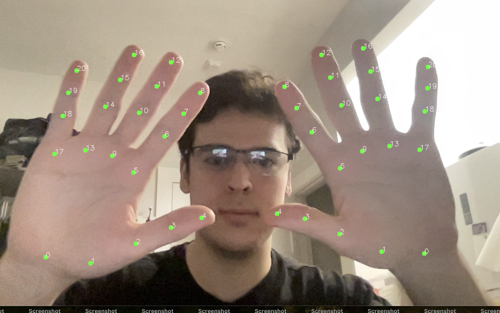
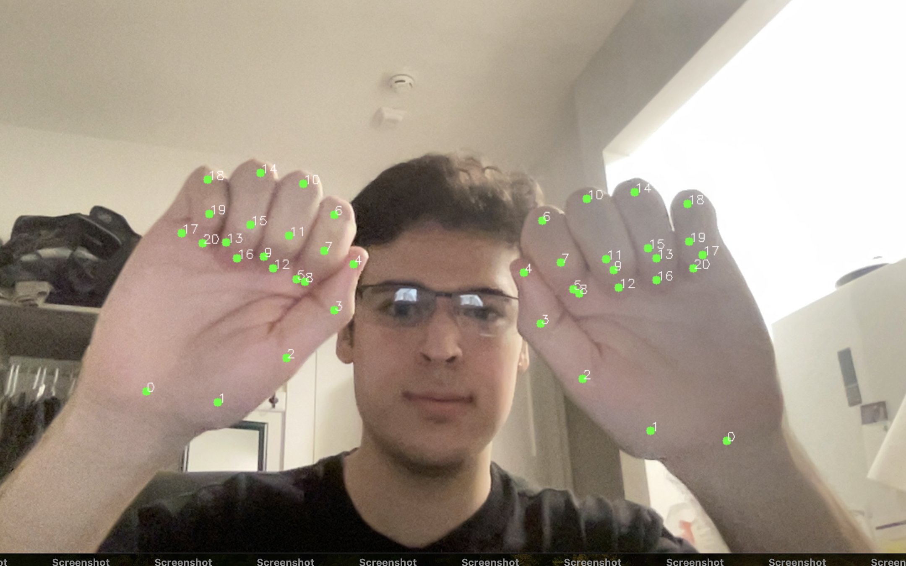
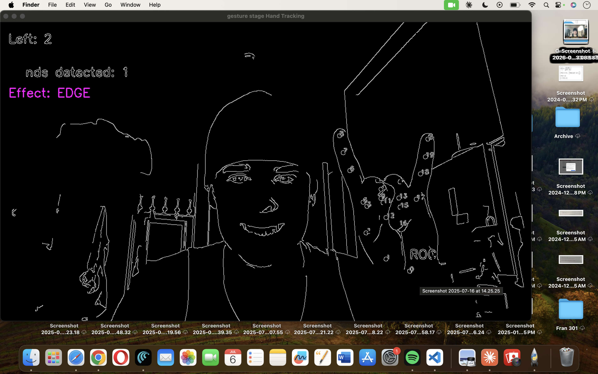

# GestureStage

GestureStage is a real-time computer vision application that uses hand gestures to control visual effects through a webcam. Built with Python, OpenCV, and MediaPipe, the project explores gesture recognition, human-computer interaction, and real-time image processing.

## Features

### Hand Tracking
- Real-time hand tracking using MediaPipe Tasks API
- Multi-hand detection
- Landmark visualization (21 landmarks per hand)
- Landmark index display (0–20)

### Gesture Recognition
Recognized gestures:

- Open Palm
- Fist
- Peace Sign
- Thumbs Up
- Rock Sign
- Point

### Visual Effects

| Gesture | Effect |
|----------|----------|
| Open Palm | Normal |
| Fist | Freeze Frame |
| Peace Sign | Party Mode |
| Thumbs Up | Approved Overlay |
| Rock Sign | Edge Detection |
| Point | Grayscale |

Additional features:

- Handedness-aware thumb detection
- Gesture cooldown system
- Persistent effect states
- Screenshot capture (`S` key)

## Tech Stack

- Python
- OpenCV
- MediaPipe Tasks API
- NumPy

## Project Structure

```text
gesture-stage/
├── app/
│   ├── webcam_test.py
│   ├── hand_tracker.py
│   └── main.py
├── assets/
├── models/
│   └── hand_landmarker.task
└── README.md
```

## Progress

### Week 1 — Hand Tracking ✅

Completed:

- OpenCV webcam pipeline
- MediaPipe Hand Landmarker integration
- Real-time landmark detection
- Landmark visualization
- Landmark index visualization
- Multi-hand tracking support

#### Landmark Detection



#### Landmark Index Visualization



---

### Week 2 — Gesture Recognition & Effects ✅

Completed:

- Finger up/down detection
- Finger counting
- Handedness-aware thumb logic
- Gesture classification system
- Effect state manager
- Cooldown system
- Freeze-frame implementation
- Visual effect pipeline

#### Open Palm → Normal


#### Fist → Freeze


#### Peace → Party Mode


#### Point → Grayscale


#### Rock → Edge Detection



#### Thumbs Up → Approved


## Controls

| Key | Action |
|------|--------|
| S | Save screenshot |
| Q | Quit application |

## Current Status

Completed:

- Hand tracking
- Finger detection
- Gesture recognition
- Visual effects system

In Progress:

- Audio-reactive effects
- Additional gesture mappings
- UI improvements
- Performance optimization

## Author

Roman Stikhin